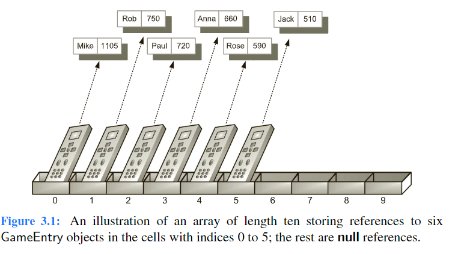

#### Using Arrays 
To maintain a sequence of high scores, we develop a class named Scoreboard. 
- A scoreboard is limited to a certain number of high scores that can be saved
- once that limit is reached, a new score only qualifies for the scoreboard if it is strictly higher than the lowest “high score” on the board
- The length of the desired scoreboard may depend on the game, perhaps 10, 50, or 500. Since that limit may vary, we allow it to be specified as a parameter to our Scoreboard constructor. 
- Internally, we will use an array named board to manage the GameEntry in- stances that represent the high scores. The array is allocated with the specified maximum capacity, but all entries are initially null. 
As entries are added, we will maintain them from highest to lowest score, starting at index 0 of the array. We illustrate a typical state of the data structure

###### Adding new entry
One of the most common updates we might want to make to a Scoreboard is to add a new entry. Keep in mind that not every entry will necessarily qualify as a high score. If the board is not yet full, any new entry will be retained. Once the board is full, a new entry is only retained if it is strictly better than one of the other scores, in particular, the last entry of the scoreboard, which is the lowest of the high scores.